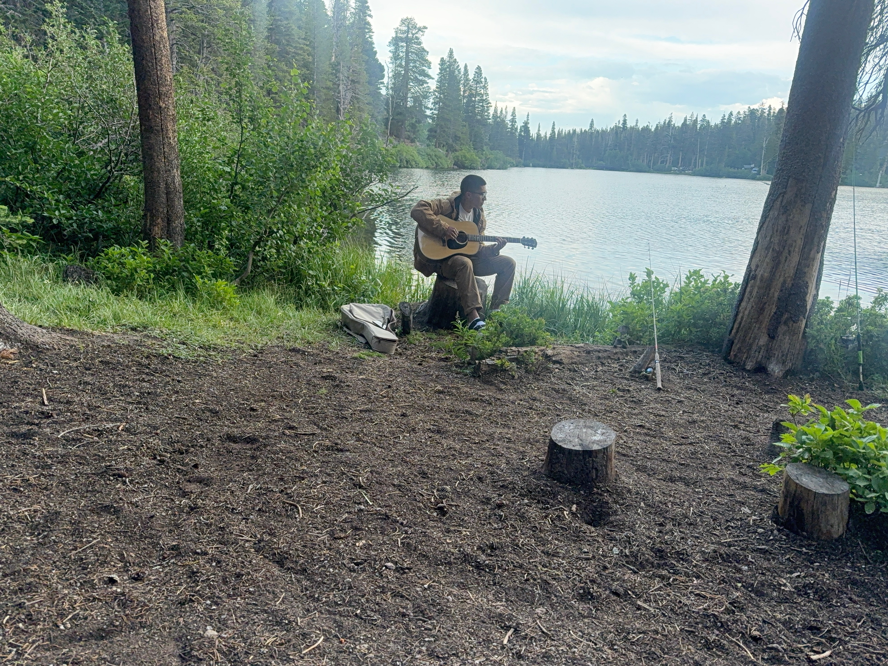
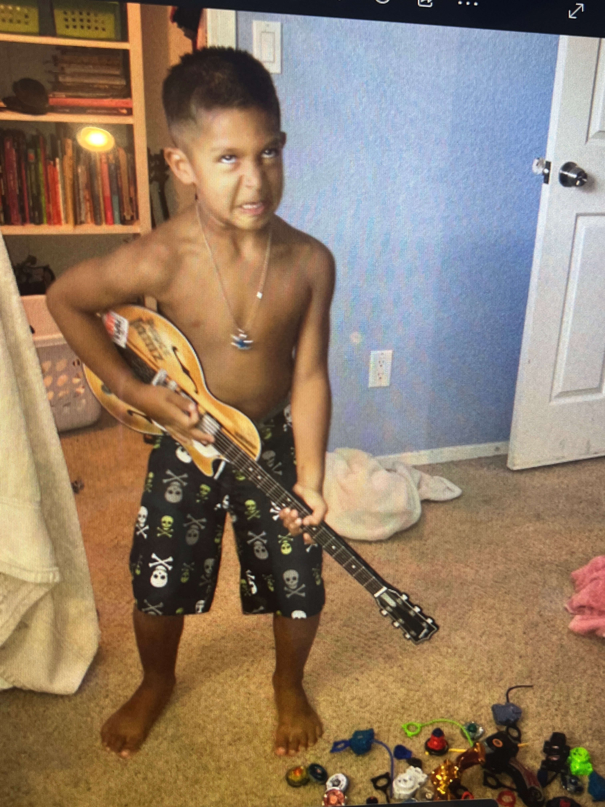

:::::::: about-page
::::::: about-intro
::::: about-left
{.about-main-photo}

:::: why-teach
## Why I Teach

I know what it's like to learn guitar without having one perfectly organized path laid out in front of you. It can be frustrating and tedious, but I also think some amount of struggling, experimenting, and figuring things out for yourself is an important part of becoming a musician.

::: struggle-photo
{.young-guitar-photo}

*And occasionally it might make you look like this.*
:::

I want lessons to give students structure without taking away that curiosity.

Rather than simply being told *"play this scale 100 times,"* I want students to eventually start asking:

> **Why does that sound like that?**

> **Why does this player phrase it that way?**

> **How can I make it sound like me?**

That's the kind of musician I want to help someone become.
::::
:::::

::: about-intro-copy
# About Me

I grew up in Tulare, a small city in California's Central Valley. For the past three years, Isla Vista has been home while I've been working toward a Physics B.S. at UCSB. Music wasn't a particularly strong part of my family or the scene I grew up around, so I feel fortunate that I eventually stumbled onto a guitar on my own.

The first time I held one was about two weeks after hearing Nirvana's MTV Unplugged performance of *The Man Who Sold the World*. I had played some trumpet in middle school, but otherwise had very little musical experience. Trying to learn the song through tabs and YouTube tutorials left me feeling like I was copying instructions without really understanding what I was hearing.

A physics teacher of mine gave me a piece of advice that changed the way I learned: *ditch the tutorials and tabs for a while, use your ear, and try to find the notes on the guitar by singing them first.*

That sent me in a completely different direction. I began learning more and more directly from recordings, slowing songs down, replaying small sections, and searching for the sounds on the fretboard myself. Tabs and tutorials are great tools, especially when the goal is simply to learn a song quickly, but I found that I wanted to dig further into the instrument.

Guitar also changed the way I listened to music. Wanting new things to play pushed me toward genres and artists I probably never would have discovered otherwise. I started spending long stretches studying albums: slowing passages down, noticing small details in a player's rhythm or technique, learning some of the theory behind what I heard, and collecting those little musical ideas into my own growing mixture of influences.

That process eventually changed the way I listen to music in general. I became less interested in simply learning the notes of a song and more interested in understanding why different players sound like themselves.

That's a big reason I wanted to start teaching.

I want to help other players develop the same tools that made guitar exciting for me: listening closely, experimenting, developing an ear, understanding the instrument, and eventually building a musical voice of their own.

You can also hear some of my playing on [YouTube](https://www.youtube.com/@BenLeon67).
:::
:::::::
::::::::
