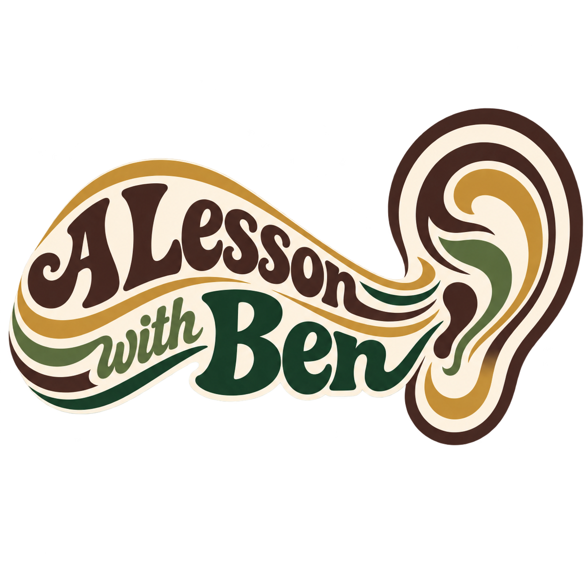

:::: {.approach-clean}

::: {.approach-visual}

{.approach-main-logo}

:::

::: {.approach-text}

# My Approach

Based on a student’s experience and interests, the order in which we learn things will vary. A fan of metal or rock may start with power chords early on, while someone completely new may first need to learn how to properly tune and handle their guitar. Over time, I want students to gain intuition and become comfortable learning from recordings rather than depending entirely on tabs or someone else giving them the answers.

A central part of that is learning to listen beyond the notes themselves. Guitar has an enormous number of subtle variables that can completely change the sound of a phrase even when the pitch stays the same. Miles Davis was an artist deeply concerned with shaping deliberate sounds, and I think that same attention can be applied to guitar. Right-hand position, pick angle, pick velocity, muting, dynamics, timing, bends, vibrato, and even the space between notes can all contribute to a player’s personality. If we’re studying somebody else’s playing, finding the correct frets and notes shouldn’t be the end goal. We should try to understand the details that created the sound we heard, learn to reproduce them ourselves, and add those ideas to our own musical vocabulary.

I also don’t see imitation as the opposite of developing your own style. Studying several musicians closely gives you more vocabulary to work with. You might absorb one player’s rhythm, another player’s vibrato, a chord voicing from somewhere else, and a handful of licks or phrasing ideas from completely different styles. Eventually those influences begin colliding and combining in ways that none of the original players necessarily would have used themselves. To me, that’s part of the process of building a unique musical identity.

:::

::::