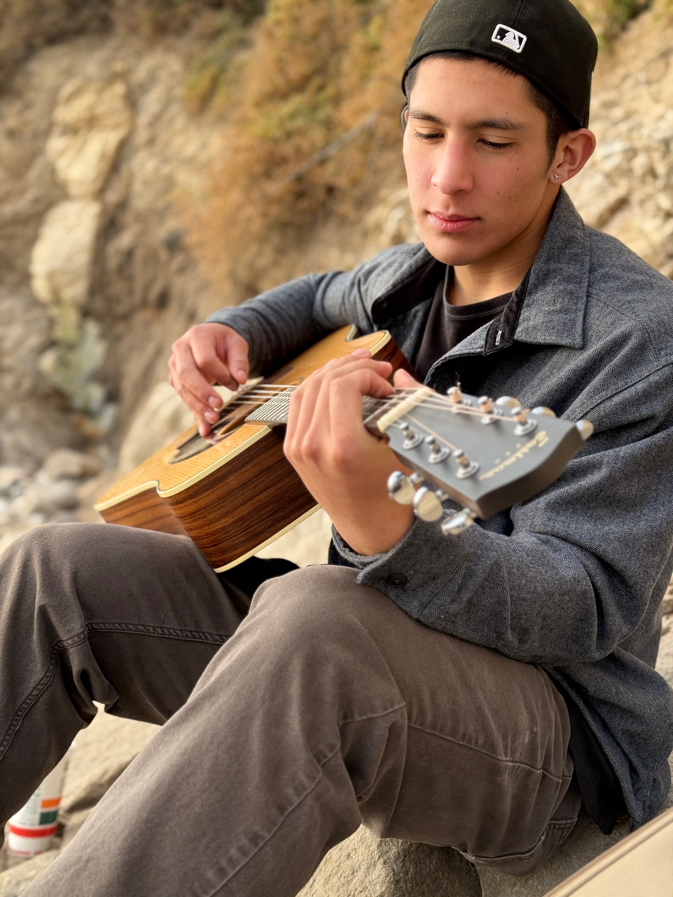
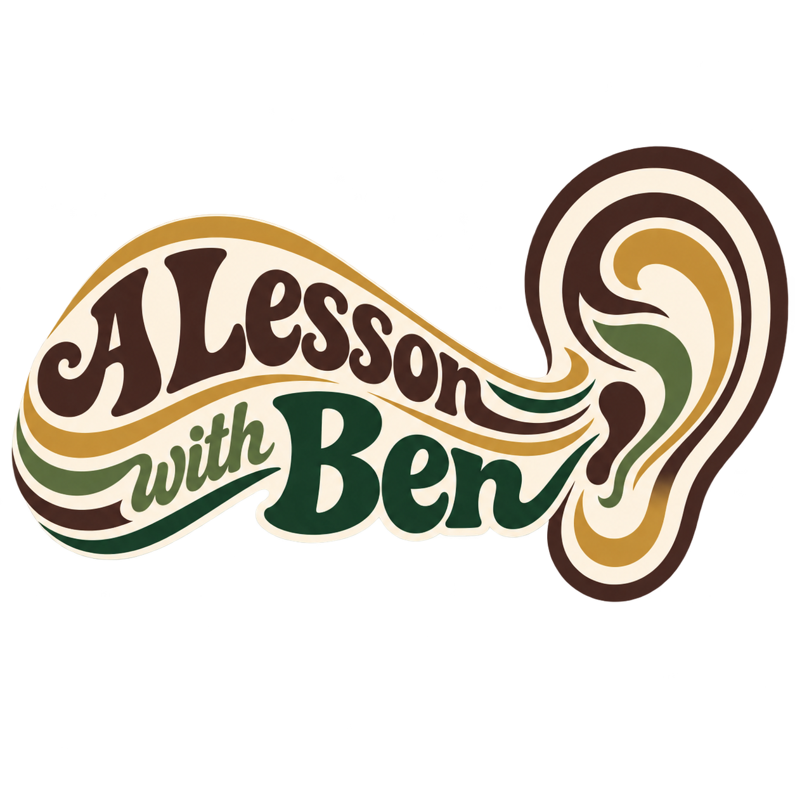

::::::::: landing-page
::: landing-photo
{.hero-photo}
:::

::::::: landing-content
::: right-logo
{.right-logo-image}
:::

::::: right-body
::: eyebrow
GUITAR LESSONS · SANTA BARBARA + GOLETA
:::

# Learn guitar through the music you love.

## Personalized lessons built around your goals, your taste, and the kind of player you want to become.

In-home guitar lessons for beginners and developing players of all ages.

::: hero-actions
[Find Your Path](lessons.qmd){.btn .btn-primary}

[Book 30-Min Lesson](https://calendar.app.google/GpYUvJxek3R5y36c9){.btn .btn-outline}

[Book 60-Min Lesson](https://calendar.app.google/q96F91WGMwzb1pcF7){.btn .btn-outline}
:::
:::::
:::::::
:::::::::

::::::: newsletter-section
:::::: newsletter-inner
:::: newsletter-copy
::: newsletter-kicker
JOIN THE NEWSLETTER · WEEKLY GUITAR TIPS
:::

## A little guitar lesson, right in your inbox.

Short weekly tips, exercises, and ideas to help you understand the guitar and find your own way around it.
::::

::: newsletter-form

```{=html}
<script async data-uid="d27265327b" src="https://a-lesson-with-ben.kit.com/d27265327b/index.js"></script>
```
:::
::::::
:::::::
