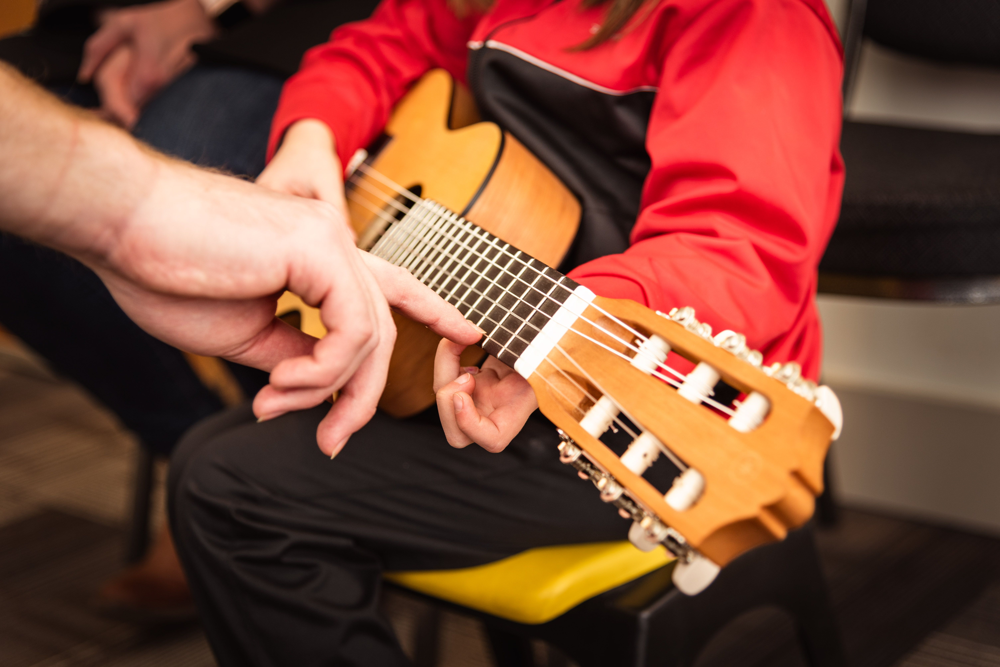
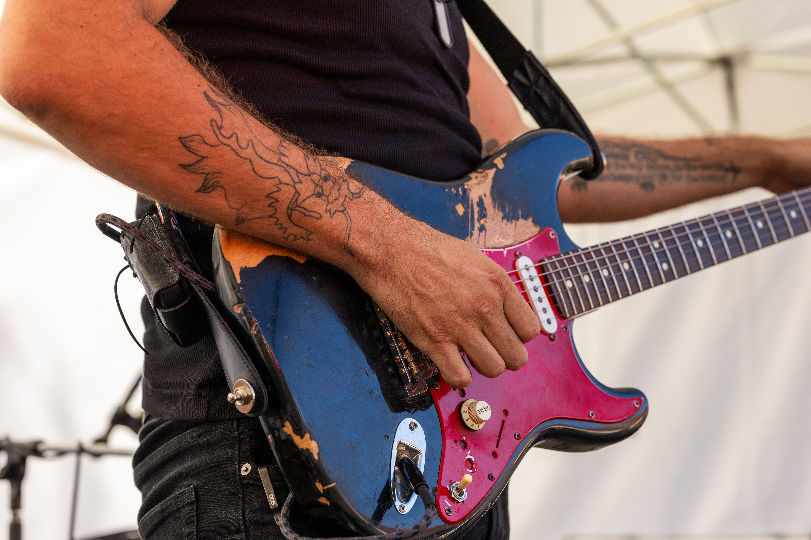
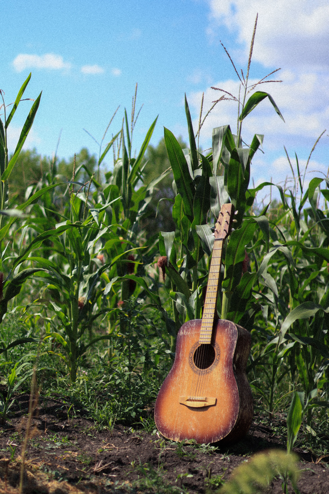
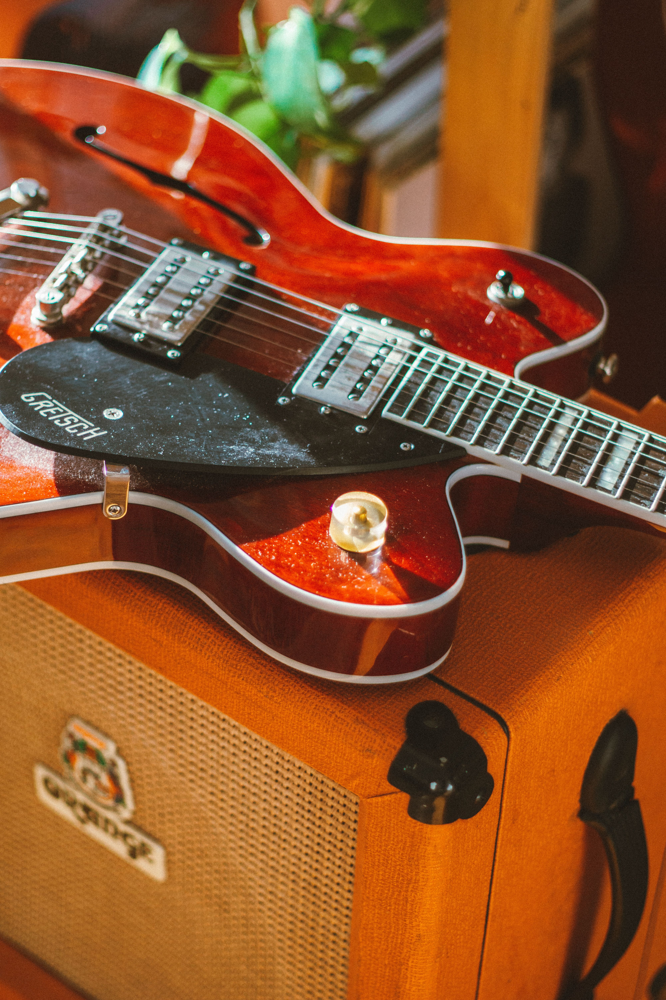
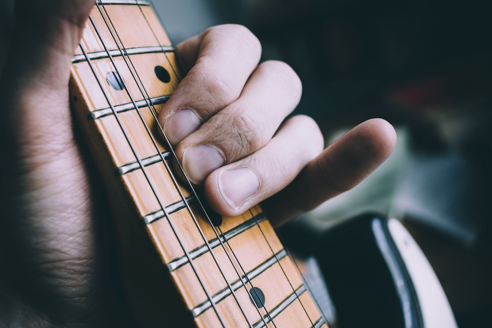

::::::::: path-gallery
::: path-tile
[{.path-image}](beginner.qmd)

### [Absolute Beginner](beginner.qmd)

Start from scratch and begin making music.
:::

::: path-tile
[{.path-image}](rock.qmd)

### [Rock / Alternative](rock.qmd)

Riffs, power chords, rhythm & lead.
:::

::: path-tile
[{.path-image}](blues.qmd)

### [Blues](blues.qmd)

Pentatonics, phrasing & improvisation.
:::

::: path-tile
[{.path-image}](songwriter.qmd)

### [Singer-Songwriter / Folk](songwriter.qmd)

Chords, strumming, fingerpicking & accompaniment.
:::

::: path-tile
[{.path-image}](jazz.qmd)

### [Jazz Foundations](jazz.qmd)

Jazz chords, harmony & improvisation fundamentals.
:::

::: path-tile
[{.path-image}](lead.qmd)

### [Lead Guitar](lead.qmd)

Technique, phrasing, solos & fretboard freedom.
:::
:::::::::
